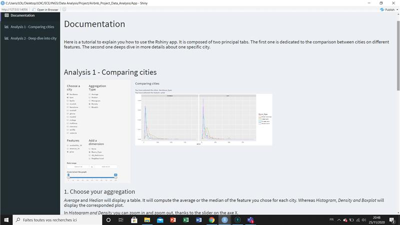
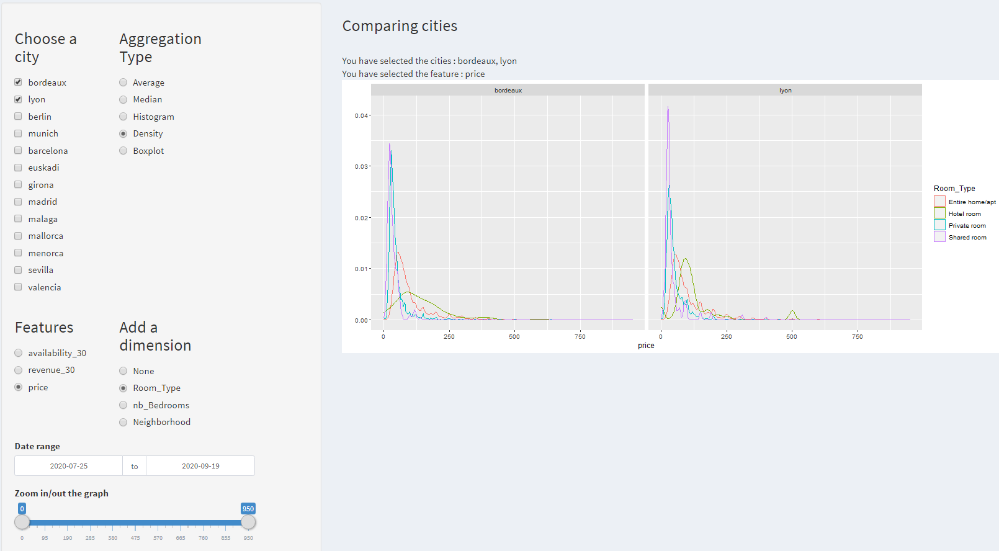
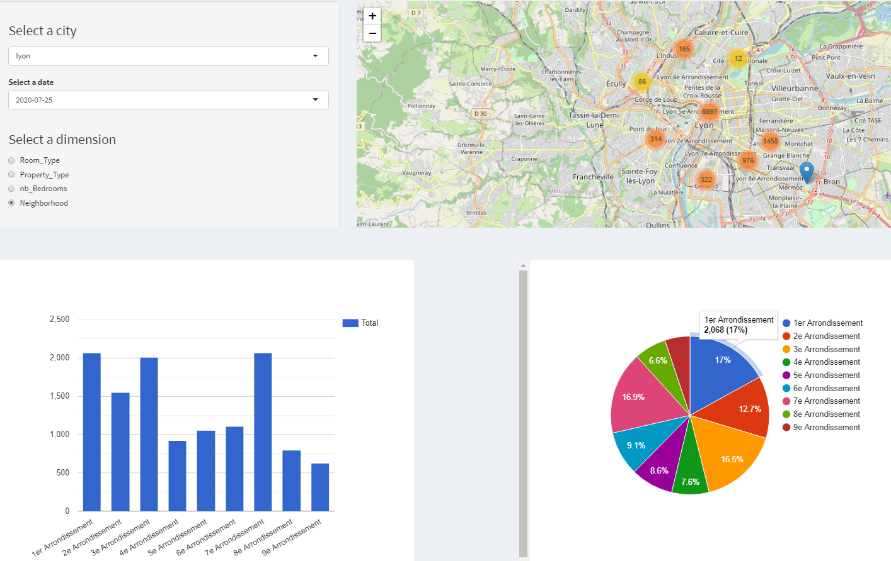

# Airbnb_Project_Data_Analysis
It is a project to use R Shiny to analyze Airbnb data 

# Getting starting with the App in Rstudio

1. Git clone the repository and open it in Rstudio `git clone https://github.com/CheongLoic/Airbnb_Project_Data_Analysis.git`
2. Unzip the the folder `/data/data_cleansed`

  Make sure the path is /data/data_cleaned/  and note /data/data_cleaned/data_cleaned
3. Get the data :
  - Open the file /Scripts/prepare_data.R
  - change working directory at line 7  as `<repo_path>/Airbnb_Project_Data_Analysis/App` 
  - uncomment the last line to get the data : `my_data <- read_cleansed_data()`
  - once you got the data, comment it again
3. Open the file ui.R or server.R in Rstudio 
4. Run the App

# App

  

  

  

